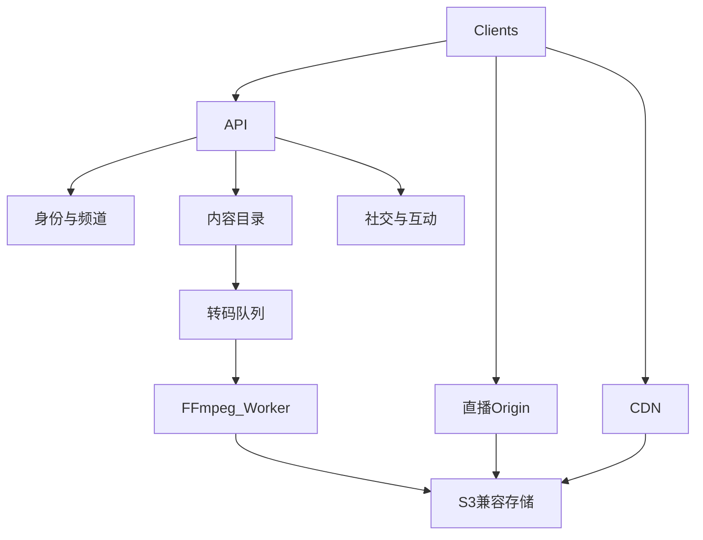

# 后端与媒体分层

业务 API 与媒体面分离：API 只管元数据与权限；字节流走对象存储 + CDN。当前部署里点播/直播 HLS 仍由 API 同源提供；公网可将 **页面走 Cloudflare、码流按地区走国内边缘（ctc 等）**，约定见 [`media-edges.md`](media-edges.md)。

## 默认技术选型（可替换，不要悬空）

- API：**Go**（[`api/`](../api/)）；以 [`openapi.yaml`](openapi.yaml) 为准
- 数据：PostgreSQL（[`schema.sql`](schema.sql) + `api/internal/db/*.sql` 迁移）。视频对外 id 为 10 位字母数字，见领域模型「ID 与时间」。Redis（会话、热计数、Feed 缓存）
- 存储：S3 兼容（AWS S3 或 MinIO）
- 点播：直传 → 队列 → FFmpeg 多档 HLS + 音轨 + VTT + 封面
- 直播：独立 Origin（SRS）；推流 RTMP；播放 HLS（EVENT 全量清单，关播补 `EXT-X-ENDLIST`）
- 搜索：先 Postgres / Meilisearch（Phase 6）

长视频多音轨：视频档位与音频轨解耦，HLS `AUDIO` / `SUBTITLES` 组关联。Phase 2 先单音轨 + 可选软字幕。
