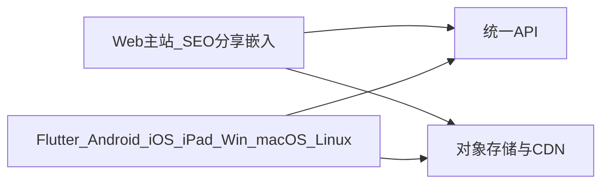

# MiniTube 客户端策略

**已确认：API 先行 + Flutter 原生全家桶 + 独立 Web 主站。** 不八端分头重写，也不把 Flutter Web 当公开主站。

## 三层分工

| 端 | 仓库 | 职责 |
| --- | --- | --- |
| 统一 API | [`api/`](../api/) | 身份、频道、目录、互动；OpenAPI 是一等契约 |
| 转码 Worker | [`worker/`](../worker/) | 上传后 FFmpeg → HLS 多档 + 音轨 + VTT |
| Flutter 应用 | [`app/`](../app/) | Android / iOS / iPadOS / Windows / macOS / Linux |
| Web 主站 | [`web/`](../web/) | 公开首页、视频页、频道页、嵌入播放器 |

## Flutter（原生全家桶）

覆盖：Android、iOS、iPadOS、Windows、macOS、Linux。

承担：登录后完整体验、短视频滑动、上传、创作者工具、桌面播放器、直播观看。

播放：`media_kit` 或官方 `video_player` + 各端硬件解码，协议以 **HLS** 为主。

**Flutter Web** 只允许做登录后的 Web App 实验，不当公开内容入口（SEO、Open Graph、MSE/HLS、嵌入页均弱于独立 Web）。

## 独立 Web 主站

技术倾向：Next.js（或同级 SSR 框架）。Phase 2 起就做公开播放页，不把「能分享的链接」拖到后期。

必须具备：

- 可索引的视频页、频道页
- Open Graph / 分享预览
- `<iframe>` 嵌入播放器（可晚于首个播放页，但路由预留 `/embed/{videoId}`）
- 浏览器播放：hls.js（点播 HLS）；日后可加 dash.js

Web 与 Flutter **只共享 API 与设计 token**，不共享 Flutter Widget 树。

## 播放协议

- 点播：HLS。桌面/Web 后期可并行 DASH。
- 直播：先 HLS / LL-HLS；低延迟再上 WebRTC。
- 多音轨 / 多字幕：HLS `AUDIO` / `SUBTITLES` 组，与视频档位解耦。

## 明确不做

- 为每个 OS 再写一套 Swift / Kotlin / WinUI / GTK 客户端（除非某端 Flutter 播放器证明不可用）。
- 用 Flutter Web 顶替主站。
- 客户端直连数据库或对象存储管理接口；媒体只走预签名 URL + CDN。
