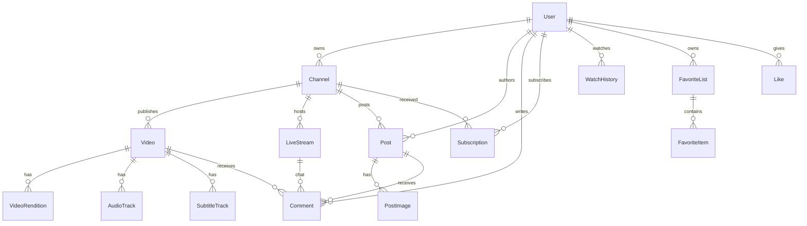

# MiniTube 领域模型（冻结）

本文冻结用户、频道、四类内容与互动关系。实现以本文与 [`schema.sql`](schema.sql)、[`openapi.yaml`](openapi.yaml) 为准。宽高比只影响默认呈现，**不是**业务类型约束。

## 核心不变量

1. **订阅对象是频道，不是用户。** 一人多频道时，订阅「美食」不连带「游戏」。
2. **频道是对外发布身份。** 长视频、短视频、直播挂在频道下；帖子可挂频道，也可仅挂作者用户。
3. **内容类型是枚举，不是比例。** `long` / `short` / `live` / `post` 区分业务；`aspect_ratio` 只是呈现提示。允许 4:3、1:1、竖屏长视频。
4. **注册后必须有且仅有一个默认频道**（`is_default = true`）。用户可再开更多频道，默认频道可更换但不能清零。
5. **评论模型共用，通道不共用。** `target_type + target_id` 覆盖视频 / 帖子 / 直播；直播聊天走实时通道，不与点播评论同一套拉取。
6. **点赞公开、收藏私有、稍后再看是系统收藏夹。** 三者不可合并成一个字段。



## 用户 User

登录标识：

- `username`：唯一，公开 URL 用，变更需谨慎（冷却期 / 旧 handle 重定向留给后期）。
- `email`：唯一，必须验证后才能发内容。手机号本期不做。

资料字段：内部 UUID、密码哈希、昵称、头像、简介、状态（`active` / `disabled` / `deleted`）、注册与更新时间。

用户侧集合都是「我对内容的关系」，不是资料本体：

| 集合 | 对象 | 可见性 |
| --- | --- | --- |
| 订阅 | Channel | 默认公开（可后期加隐私） |
| 观看记录 | Video | 仅自己 |
| 收藏夹 | Video / Post / LiveStream | 仅自己 |
| 我的评论 | Comment | 随目标内容可见性 |
| 点赞 | Video / Post / Comment | 公开计数；明细仅自己 |

匿名观看可用设备级临时记录，登录后按 `video_id` 合并进度（取较大 `position_ms`）。

## 频道 Channel

- 每用户 1～N 个频道；`handle` 全局唯一（如 `@food`），是频道页路径。
- 对外字段：名称、handle、头像、封面、简介、主题标签、可见性（`public` / `unlisted` / `private`）。
- 个人主页列出「TA 的频道」；**订阅按钮在频道页**，不在用户页一键全订。

## 内容对象

### 长视频 / 短视频 Video

同一张 `videos` 表，用 `kind` 区分：

- `long`：完整观看、搜索、订阅时间线；播放器按横屏为主布局。
- `short`：发现流、上下滑；播放器按竖屏为主布局。

共用能力：标题、简介、封面、时长、宽高、状态机、定时发布、章节（后期）。

状态机：`draft` → `uploading` → `processing` → `ready`；可 `unpublished` 或 `failed`。

媒体面（与元数据分离）：

- **VideoRendition**：视频档位（如 360/720/1080），HLS 分片，不含音频或仅默认音。
- **AudioTrack**：按语言/解说独立 rendition，HLS `AUDIO` 组。
- **SubtitleTrack**：独立 WebVTT，HLS `SUBTITLES` 组。

不要为每种语言重压整条视频。Phase 2 先跑通单音轨 + 可选软字幕，表结构预留多轨。

### 直播 LiveStream

挂在频道下。状态：`scheduled` / `live` / `ended`。拥有推流密钥、播放地址；结束后可选生成 `vod_video_id` 指向一条 `Video`。

聊天是 `Comment` 且 `target_type = live`，读取走 WebSocket / SSE，不走点播评论分页 API 作为主路径。

### 社交帖 Post

作者必为 User；`channel_id` 可选。多图（有上限）+ 有限正文。不走 FFmpeg。可 @ 一条 Video（`mentioned_video_id` 可选）。

## 互动

### 评论 Comment

```
target_type: video | post | live
target_id: Video 用 10 位公开编号；Post / Live / Comment 仍为 UUID
parent_id: 可空（楼中楼）
```

点播/帖子：HTTP 分页。直播：实时通道为主，落库便于回放与 moderation。

### 点赞 Like

`target_type + target_id + user_id` 唯一。计数冗余在目标表上，以互动表为准可对账。

### 收藏 FavoriteList / FavoriteItem

每个用户至少一个系统列表 `watch_later`。用户可建更多私有列表。条目指向 `video` / `post` / `live`。

### 观看记录 WatchHistory

`(user_id, video_id)` 唯一。记录 `position_ms`、`duration_ms`、`completed`、`last_watched_at`。短视频也写，供「看过」去重。播放页底边有只读进度条，不可 seek。

## ID 与时间

- **Video 对外主键**为 10 位大小写字母+数字（`^[A-Za-z0-9]{10}$`，如 `Pgf2Cqy0CH`）。新建走 `ident.NewVideoID`；库表 `videos.id` 在迁移 **014** 从 UUID 改成该格式，已有行各生成不重复新码。
- **旧 UUID URL**（`/shorts/{uuid}`、`/v1/videos/{uuid}`）仍可用：`video_id_legacy(old_id → video_id)` + `ResolveVideoID`。媒体目录 `hls/`、`sources/`、`tmp/` 按新 id 改名，旧名留符号链接。
- 用户、频道、直播、帖子等其余业务主键仍是 UUID。
- 评论 / 点赞 / 收藏的 `target_id` 对视频存 10 位码，对其它类型仍存 UUID 的 text。
- 时间一律 UTC，`timestamptz`。
- 对外计数（播放、点赞、订阅）可冗余，写路径更新或异步对账。

## 明确不写入本模型

- 用 `aspect_ratio > 1` 当主键或 check 约束区分长短视频。
- 订阅用户（`subscriptions.user_id` 指向被订阅人）。
- 把直播聊天做成与点播评论同一套同步拉取。
- 广告、电商、弹幕、推荐特征向量（Phase 6 再开表）。
