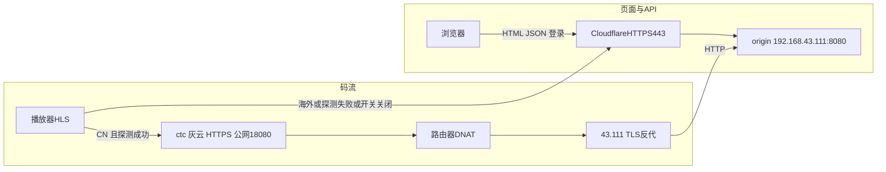

# 码流边缘分流（ctc / Cloudflare）

页面与 API 仍走 `https://minitube.19121122.xyz`（Cloudflare）。大流量 HLS 按地区走国内直连边缘（一期：中国电信 `ctc`）。**应用已按本文实现**；缺省开关关闭，行为与改造前相同。

## 结论

方向正确：HTML / JSON / 登录继续 Cloudflare；只有清单和 TS 走电信直连。播放器先拿 playback JSON 再拉 m3u8/ts，档位路径是相对的（如 `720/index.m3u8`），**master 一旦切到 ctc，分片会跟过去**。

不能做成 `http://ctc.minitube.19121122.xyz:18080`。主站已是 HTTPS（Cloudflare 终止 TLS，源站仍是 `192.168.43.111:8080`，见 [`k8s/minitube/README.md`](../k8s/minitube/README.md)）。浏览器会拦截 HTTPS 页上的明文 HTTP 媒体（mixed content）。端口可以不是 443，**协议必须是 HTTPS**：`https://ctc.minitube.19121122.xyz:18080`。证书必须是浏览器信任的公网证书（Let's Encrypt DNS-01）。Cloudflare Origin CA 只给橙云回源，直连浏览器不认。

`ctc` DNS **必须灰云（仅 DNS）**。橙云会把流量绕回 Cloudflare，分流失效。

## 现状（实现时必须先拆）

媒体 URL 被故意钉在页面源上，以便局域网 `http://192.168.43.111:8080` 和公网域名都能播：

- 服务端 [`api/internal/httpapi/origin.go`](../api/internal/httpapi/origin.go) `sameOriginMediaURL`：把 `/v1/media/`、`/v1/live/` 的 host 改成当前请求 Host。
- 客户端 [`player.js`](../api/internal/httpapi/player.js)、[`shorts.html`](../api/internal/httpapi/shorts.html)、[`shorts-hwtest.html`](../api/internal/httpapi/shorts-hwtest.html) 同样改回 `location.origin`。

即使 API 返回 ctc，前端也会拧回 Cloudflare。分流第一刀：停止无条件 same-origin 改写，改为按选中的媒体基址改写。

| 流量 | 路径 | 是否走 ctc |
| --- | --- | --- |
| 点播 HLS | `/v1/media/hls/.../*.m3u8` `*.ts` | 是 |
| 直播 HLS | `/v1/live/{id}/hls/...` | 是 |
| 字幕 VTT | `/v1/media/.../*.vtt` | 与 HLS 同一媒体基址 |
| 封面 / 头像 / 帖图 | `/v1/media/...` 图片 | 一期否 |
| 页面、API、上传 | `/`、`/v1/...`、`/v1/uploads/` | 否，继续 Cloudflare |

## CORS（分流后媒体跨源）

**源** = 协议 + 主机名 + 端口。`https://minitube.19121122.xyz` 与 `https://ctc.minitube.19121122.xyz:18080` 不同源。页面在 A、码流在 B 时，浏览器把拉流当跨源。

**CORS** 拦的是浏览器里的 JS，不是服务器收包。现有服务端（[`server.go`](../api/internal/httpapi/server.go)）：

- `AllowedOrigins: *`
- 允许 `Authorization`、`Accept`、`Content-Type`
- `AllowCredentials: false`（不要给 ctc 打开；打开后不能再用 `*`，也不该把 `mt_access` cookie 送到 ctc）

hls.js / shorts worker 会给媒体请求加 `Authorization: Bearer`（[`token.js`](../api/internal/httpapi/token.js)、[`shorts-worker-src.js`](../api/internal/httpapi/shorts-worker-src.js)）。这会触发 **OPTIONS 预检**。chi CORS 中间件会处理；ctc 前的反代必须放行 OPTIONS。建议 `AllowedHeaders` 补 `Range`，`ExposeHeaders` 视情况带 `Content-Range`、`Accept-Ranges`。

Fetch 的 **credentials** 指 cookie / TLS 客户端证书，不是 Bearer 头。鉴权继续放在 Authorization。

## 拓扑



TLS **不在家用路由上做**。路由器只做端口映射：公网 `18080` → **`192.168.43.111:18080`**。API 进程在该端口做 HTTPS（`MEDIA_EDGE_TLS_ADDR=:18080`），证书在 PVC `/data/ctc-tls/`。TLS 监听上的请求（以及 `Host` 为边缘名）只放行 `/v1/media/`、`/v1/live/.../hls/` 和 `/v1/media/edge-probe`，即使 `media_edges` 还是空数组。

后续联通 / 移动：`cuc.minitube...`、`cmc.minitube...`，同一套「边缘列表 + 探测选路」，不要在服务端猜 ISP。

```text
浏览器 --HTTPS:公网18080--> 路由器 DNAT
                         --> 192.168.43.111:18080  minitube-api TLS
                         （同一进程内只处理媒体路径；8080 仍给 Cloudflare 明文回源）
```

## 选路

三层，缺一不可：

1. **提示**：Cloudflare `CF-IPCountry=CN`，可由 `GET /v1/public/site` 带回 `mediaHint`。VPN / 误判会错。
2. **探测**：对候选边缘发很小的 GET（公开小 ts；ctc 若只开放媒体路径则不要用 `/healthz`）。比延迟、看 HTTPS 是否成功。大陆选 `ctc`，海外选页面源（Cloudflare）。
3. **回退**：边缘端口不通、证书失败、NAT 环回失败 → 立刻回 Cloudflare。

家庭宽带访问自家公网域名常要 NAT hairpin；探测失败就回退。不要用时区、语言猜地区。一期不做智能 DNS 分线路。

## TLS 与 DNS

- `minitube.19121122.xyz` 继续橙云；`ctc`（以及以后的 `cuc` / `cmc`）**灰云** A 记录，TTL 60–120s，DDNS 只改这条。
- Web 上线即 HTTPS，不要先上明文 18080。
- 原生 App 以后可以另议；主站按浏览器约束。

灰云直连家宽，Cloudflare 不替 18080 签证书。用 Let's Encrypt（或同等公网 CA），**DNS-01**（HTTP-01 要 80，TLS-ALPN-01 要 443，家宽入站都不可用）。

域名在 Cloudflare 时：`acme.sh` 或 `lego` + 该 zone 的 DNS Edit API Token。

1. 申请 `ctc.minitube.19121122.xyz`。
2. 客户端写入 TXT `_acme-challenge.ctc.minitube.19121122.xyz`。
3. LE 查 DNS 后签发 `fullchain.pem` + `privkey.pem`。
4. 证书 90 天有效，约 60 天自动续；续期仍走 DNS-01。

证书挂在 API 的 18080 TLS 上，路径 `/data/ctc-tls/fullchain.pem` 与 `privkey.pem`（PVC）。进程首次启动若文件不存在会写入一张自签证书，方便打通端口；**浏览器不信任自签**，探测会失败并回退 Cloudflare。换成 Let's Encrypt 后重启 `minitube-api`。

验收：`curl -vI https://ctc.minitube.19121122.xyz:18080/v1/media/...` 证书 SAN 匹配、签发者 Let's Encrypt、无证书错误。主站页拉流无 mixed content、无 `NET::ERR_CERT_*`。

## 配置（Postgres `site_settings`）

与 [`shorts-playback.md`](shorts-playback.md) 的 `shorts_engine` 同一张表，热改，不进 k8s ConfigMap。

| key | value | 缺省 |
| --- | --- | --- |
| `media_edge_enabled` | `off` \| `on` | `off`（行为与改造前相同：媒体走页面 origin / Cloudflare） |
| `media_edges` | JSON 数组 | `[]` |

`media_edges` 示例：

```json
[{"id":"ctc","base":"https://ctc.minitube.19121122.xyz:18080","regions":["CN"]}]
```

- 读：`GET /v1/public/site`（未登录可读），带出 `mediaEdgeEnabled`、`mediaEdges`，以及请求头推导的 `mediaHint`。
- 写：`PATCH /v1/admin/site`。公网 `/admin` 口令+TOTP（登录失败会按 IP 限频并锁定）。改口令 / 重新绑定动态密码只允许局域网 `http://192.168.43.111:8080/admin/setup`，经 Cloudflare 或公网域名访问返回 404。user id 在 `ADMIN_USER_IDS` 中的账号仍可 PATCH。打开 `mediaEdgeEnabled` 时若列表里还没有 `ctc`，会写入缺省 `https://ctc.minitube.19121122.xyz:18080`。
- 关掉后前端不再改写媒体 host。换公网端口只改 `media_edges[].base`。
- playback JSON 仍给路径级 URL；选 host 在浏览器（探测需要浏览器）。

## 开关怎么配

缺省 `media_edge_enabled=off`，全部媒体仍走页面源 / Cloudflare。证书和灰云 DNS 就绪后，打开 `/admin` 勾选「分流到 ctc」，或：

```bash
# 先写入边缘列表（可反复 PATCH）
curl -sS -X PATCH https://minitube.19121122.xyz/v1/admin/site \
  -H "Authorization: Bearer $TOKEN" -H "Content-Type: application/json" \
  -d '{"mediaEdges":[{"id":"ctc","base":"https://ctc.minitube.19121122.xyz:18080","regions":["CN"]}]}'

# 确认探测 https://ctc.minitube.19121122.xyz:18080/v1/media/edge-probe 为 204 且证书受信任后，再打开
curl -sS -X PATCH https://minitube.19121122.xyz/v1/admin/site \
  -H "Authorization: Bearer $TOKEN" -H "Content-Type: application/json" \
  -d '{"mediaEdgeEnabled":true}'
```

调用方 user id 须在 `ADMIN_USER_IDS`。关掉：`{"mediaEdgeEnabled":false}`。单页强制走 ctc：`?mediaEdge=ctc`（仍会探测，失败则回退）。

## 应用改造要点

- 前端 [`media-edge.js`](../api/internal/httpapi/media-edge.js)：`GET /v1/public/site` → 按 `mediaHint` 探测 → `mtMedia.rewrite` 只改 `/v1/media/hls/*.m3u8|ts|vtt` 与 `/v1/live/`。局域网私网 IP 不走边缘。
- 服务端 `sameOriginMediaURL`：URL 已是已配置边缘 host 时保持原样；否则改回当前请求源（局域网调试仍可用）。
- CORS 预检含 `Range`。VOD `.ts` 为 `public, max-age=86400`。直播 m3u8 仍 `CDN-Cache-Control: no-store`。

## 边界

- **出口带宽**：大陆用户直打家宽上行。适合小规模；要上量仍需国内 CDN 或多线机房。
- **非标准端口**：家宽入站常见禁 **80/443**，所以用 18080；不是电信普遍禁 18080。拦 18080 的多半是客户端网络只放出站 80/443（校园网、酒店、公司防火墙）。可换 `8443`、`20443` 等，写在 `media_edges`。若对端只允许 443 而家宽入站 443 又被封，只能回退 Cloudflare。
- **页面首包**：大陆打开 HTML/API 仍绕 Cloudflare，体积小。上传仍绕海外，以后再谈。
- **鉴权**：私有视频跨源靠 Bearer，不靠 cookie。

## 验收（实现阶段）

- 海外：媒体 Host 仍是 `minitube.19121122.xyz`。
- 大陆（`CF-IPCountry: CN` 或 `?mediaEdge=ctc`）：master/ts 为 `https://ctc...:18080`。
- `media_edge_enabled=off`：全部媒体仍走页面 origin / Cloudflare。
- 关掉边缘端口：自动回退主站仍能播。
- HTTPS 页无 mixed content。
- 局域网 IP 打开站点：与现在一致，不误打公网 ctc。
- 直播与点播、legacy hls.js 与 webcodecs shorts 都走同一套 `mediaURL`。
